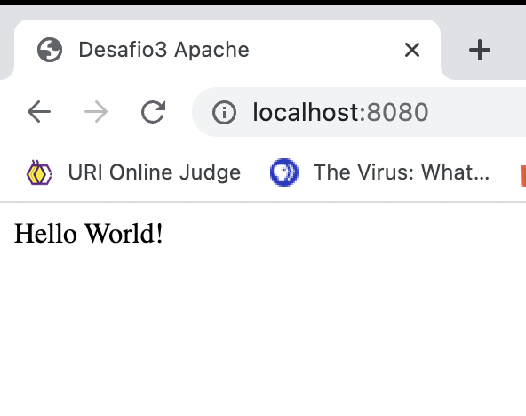

# Desafio 3
1. Crie um container com as seguintes características:

  - Crie uma pasta em seu desktop e nele crie um arquivo chamado index.html e nele construa uma pagina com um hello world!
  - A imagem que deve ser utilizada é httpd:2.4 (apache) ;
  - O nome do container deve ser apache;
  - Executa-lo em modo daemon;
  - Faça o redirecionamento de porta 8080 para 80;
  - Faça o mapeamento da pasta que você criou com o arquivo index.html para dentro do container (local dentro do container: /usr/local/apache2/htdocs/);

```
sed -ri -e "/^Listen 80/c\Listen ${PORT}" /etc/httpd/conf/httpd.conf && \
    chown -R apache:apache /etc/httpd/logs/ && \
    chown -R apache:apache /run/httpd/
```

  - Exponha o valor definido na variável de ambiente PORT para que os usuários do contêiner saibam como acessar o Apache Web Server;
  - Com a pasta criada no seu desktop e dentro dela o arquivo index.html, o arquivo deve ser copiado para a pasta do Apache
  - DocumentRoot (/var/www/html/) dentro do container.

**RESPOSTA:**
  
`docker build -t imagem-apache:2.4 .`

`docker run --name apache -d -p 8080:80 imagem-apache:2.4`

  

2. Apos o container executado utilize o comando curl ou o seu navegador para acessar o arquivo index.html que foi criado.

**RESPOSTA:**

`curl http://localhost:8080`

 